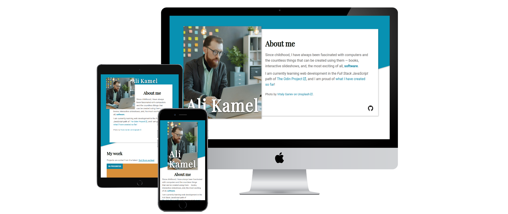

# Homepage

A responsive homepage — something you might find on a portfolio site of sorts.

> [!NOTE]
> I am _temporarily_ using this project as my portfolio site until I build one when I finish The Odin Project's curriculum. Even then, it is going to be continually updated to include any new projects.

> [!NOTE]
> **New features and fixes!**
> - Page load animations in page header
> - Hover and focus color transitions for icon links
> - Disable animations that trigger undesirable effects in users with motion sensitivities based on operating system setting ([`prefers-reduced-motion`](https://developer.mozilla.org/en-US/docs/Web/CSS/Reference/At-rules/@media/prefers-reduced-motion))
> 
> **Features and fixes coming soon!**
> 1. Scroll-driven animations
> 2. Project screenshots

This is my final HTML/CSS project in the [Full Stack JavaScript](https://theodinproject.com/paths/full-stack-javascript) path of [The Odin Project (TOP)](https://theodinproject.com), created as a practice on [responsive design](https://theodinproject.com/paths/full-stack-javascript/courses/advanced-html-and-css#responsive-design), with an additional focus on accessibility on my part.

> [!NOTE]
> Despite being primarily a practice project, contributions are still welcome! You can try resolving any [issues](https://github.com/alikamel-dev/homepage/issues), or, if you think you have found one, feel free to [create an issue](https://github.com/alikamel-dev/homepage/issues/new) or solve it and [create a pull request](https://github.com/alikamel-dev/homepage/compare).

## Viewing the site

You can [view the project on GitHub Pages](https://alikamel-dev.github.io/homepage). Do not forget to **resize the window** to see how the site responds!

Currently, there are two unexpected but minor bugs that occur on resizing the browser window on the same device:
- The page load animation plays when the page switches to the tablet layout during resizing, but not when it switches to the desktop and the mobile layouts.
- The author name "Ali Kamel" uses an incorrectly large size and an incorrect position when the the page switches to the tablet layout, requiring a page reload to correct them.

> [!IMPORTANT]
> This site is developed primarily for the latest version of [Google Chrome](https://google.com/chrome). Most of the features that the site uses are [Baseline](https://web.dev/baseline) or otherwise progressive enhancements that fail gracefully, so the site should display and function properly, with minor visual differences, in the latest versions of:
> - Chrome (Desktop and Android)
> - [Edge](https://microsoft.com/edge) (Desktop)
> - [Firefox](https://firefox.com) (Desktop and Android)
> - [Safari](https://apple.com/safari) (macOS and iOS)

> [!NOTE]
> If you have any kind of motion sensitivies, you can still safely view the site as long as [animations are disabled in your operating system](https://developer.mozilla.org/en-US/docs/Web/CSS/Reference/At-rules/@media/prefers-reduced-motion#user_preferences). Motion-based animations that may trigger discomfort, as well as smooth scrolling, are automatically disabled based on the operating system setting.

> [!TIP]
> If you encounter an issue with the site, try installing the latest version of one of the aforementioned web browsers. If that does not work, feel free to [create an issue](https://github.com/alikamel-dev/homepage/issues/new) or solve it and [create a pull request](https://github.com/alikamel-dev/homepage/compare).

## Design

The site is designed to closely resemble the [original design](https://github.com/alikamel-dev/homepage/tree/main/design) provided by The Odin Project for desktop, tablet, and mobile layouts. That said, there are some differences, listed below.

### Differences from the original design

#### General

- The content in the original design has been replaced by content about me.

- Links to online accounts in my implementation may link to more, less, or different online platforms than those in the original. If a link to an [X](https://x.com) account is included, it will use the current X logo instead of the former Twitter logo used in the original design.

- The design files do not contain interactive text elements, such as links and buttons, thus I chose my own variants of the colors used in the design for these links with accessibility in mind.

- The design files do not contain selected text, thus I chose the colors and background colors for selected text with accessibility in mind.

- Interaction effects (e.g. hover and focus effects), transitions and animations were entirely decided by me.

- Obviously there are slight differences in text, icon, and image sizes, as well as differences in spacing, alignment, and other properties, mainly due to the lack of any measurements in the original design, and sometimes for aesthetic purposes.

> [!NOTE]
> Currently, there is an issue where resizing the browser window causes the header animations that play on page load to play when the page switches to the tablet layout, but not when it switches to the desktop and the mobile, leading to inconsistent behavior. I am going to work on fixing this issue.

#### _About me_ section

- The two images of a woman in the original design have been replaced by two stock images of a man in similar positions (that man is _not_ me — I do not have a good photo of myself handy at the moment). The author of the aforementioned two stock images is attributed at the bottom of the section.

#### _My work_ section

- There is a button at the start of this section that allows sorting projects from the latest (default) or the earliest.

- Screenshots of projects may replace the _screenshot of project_ text placeholder in some or all of the project cards.

- There are _latest_ and _in progress_ tags in the upper-left corner of the card corresponding to the latest project and cards corresponding to projects in progress, respectively.

- The card corresponding to the latest project is highlighted for a small amount of time when scrolled into view.

- Cards corresponding to projects in progress do not contain links to their GitHub repositories or GitHub Pages websites.

#### _Contact me_ section

- A variant of black is used as the text color instead of the white color used in the original design, in order to ensure adequate color contrast and thus promote accessibility.

### Fonts

My implementation uses the same fonts used in the [original design](https://github.com/alikamel-dev/homepage/tree/main/design): [Playfair Display](https://fonts.google.com/specimen/Playfair+Display) for heading text and [Roboto](https://fonts.google.com/specimen/Roboto) for regular text.

### Colors

My implementation uses the same colors used in the [original design](https://github.com/alikamel-dev/homepage/tree/main/design), except for some differences, most of which have been documented [above](#differences-from-the-original-design).

The following are the colors I used for the design of the site. Each hexadecimal color value links to the [ColorHexa](https://colorhexa.com) page of the color.

| Color                                                                                                                           | Hexadecimal color value                   | CSS Variable                  |
|---------------------------------------------------------------------------------------------------------------------------------|-------------------------------------------|-------------------------------|
| **Primary color**: Background color for header decoration and footer.                                                           | [`#0891b2`](https://colorhexa.com/0891b2) | `--brand-color-primary`       |
| **Secondary color**: Background color for main content.                                                                         | [`#ffffff`](https://colorhexa.com/ffffff) | `--brand-color-secondary`     |
| **Alternate primary color**: Used instead of the primary color in some areas to ensure adequate color contrast.                 | [`#0881a0`](https://colorhexa.com/0881a0) | `--brand-color-primary-alt`   |
| **Alternate secondary color**: Used instead of the secondary color in footer to ensure adequate color contrast.                 | [`#1c1c1c`](https://colorhexa.com/1c1c1c) | `--brand-color-secondary-alt` |
| **Heading text color**: Used for headings, except the first-level heading containing the author name. Also used for icon links. | [`#060b04`](https://colorhexa.com/060b04) | `--text-color-display`        |
| **Regular text color**: Used for regular text, with exceptions listed below.                                                    | [`#575655`](https://colorhexa.com/575655) | `--text-color-body`           |

#### Additional notes

- **Selection colors**: The foreground and background colors are the secondary and alternative primary colors, respectively, except in the footer where the colors are inverted.

- **Project card tag colors**: The foreground and background colors are the secondary and alternate primary colors, respectively.

- The color of the border used to highlight the latest project matches the background color of the _latest_ tag.

- The primary color is also used as a fallback background color in project screenshot placeholders in case the script used to apply random background colors to them does not load.

- The alternate colors are used in the outlines of interactive elements that appear on keyboard focus.

- Icons used to represent links to online accounts have their original brand colors in the header, and the alternate secondary color in the footer, when hovered or keyboard-focused. The same colors are also applied to their outlines on keyboard focus.

## Other Projects

Feel free to view all of my projects [here](https://alikamel-dev.github.io/homepage).
